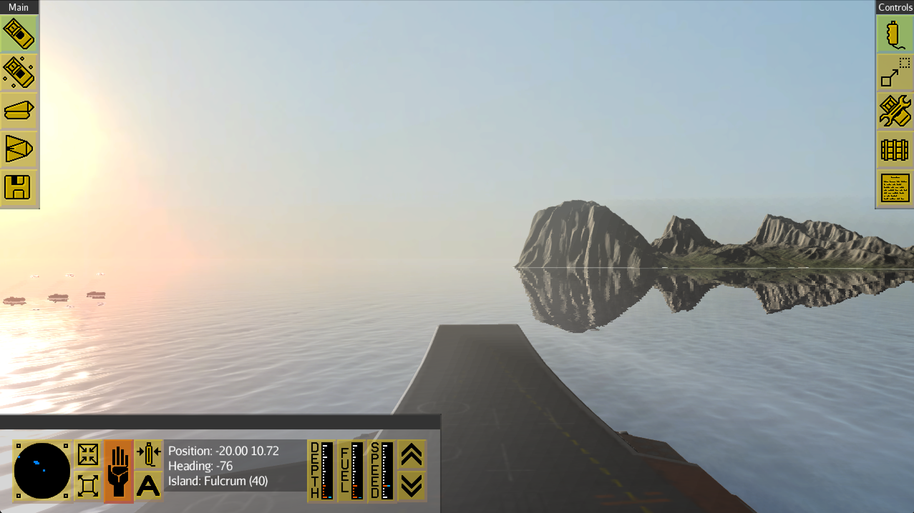
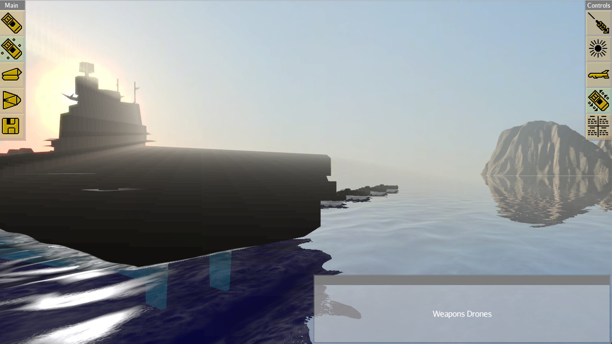
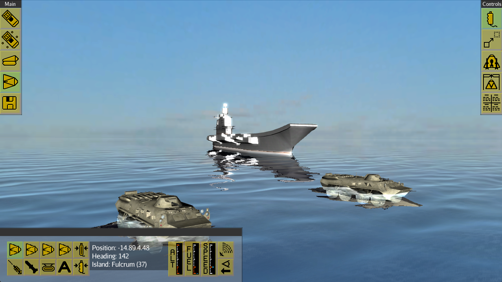
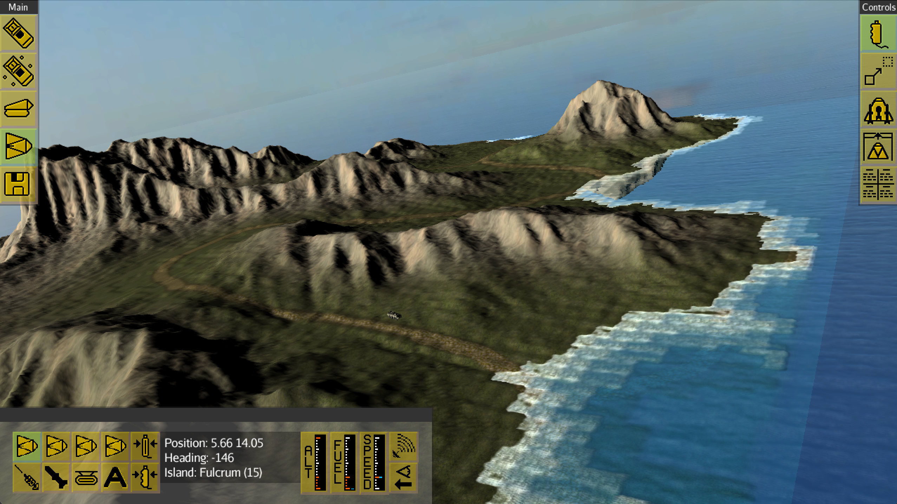
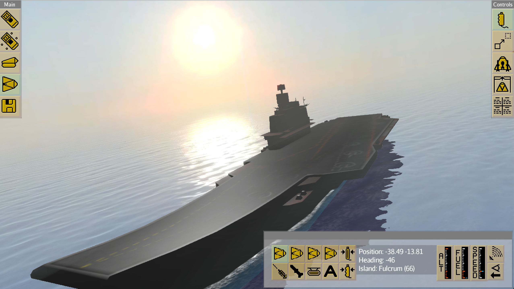
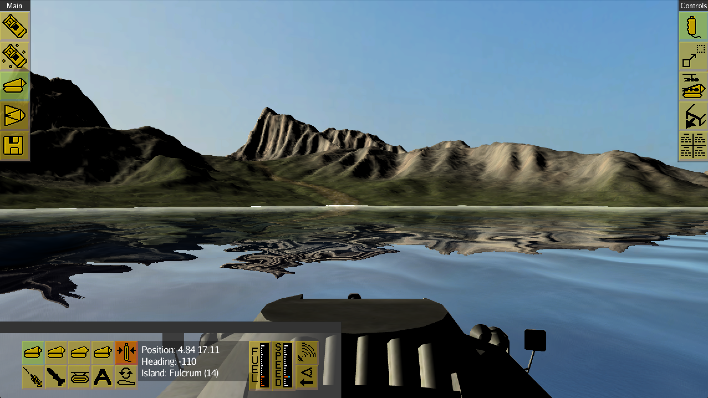
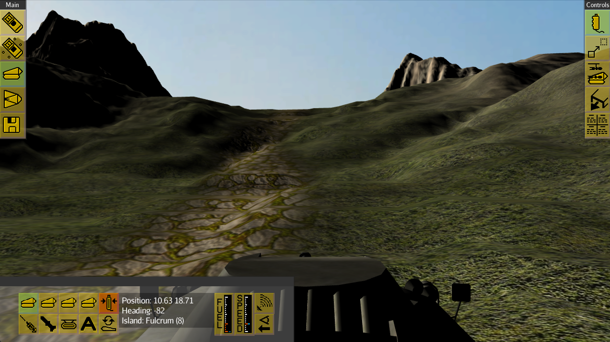
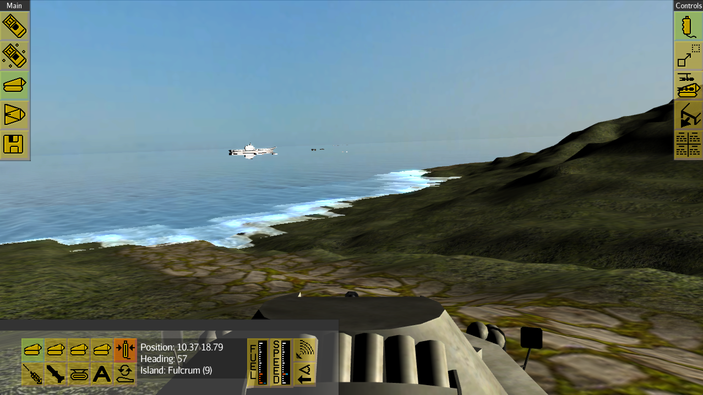

# CarrierCommander
A java based open source re-make of a fantastic 80's game...

##Purpose of this re-make
1) Keep up the original spirit of the game: It's a futuristic strategy game and machines are fighting against each other - humans are controlling remotely
2) Use state-of-the-art graphics based on OpenGL
3) Make the program run on major platforms (Linux, Mac, Windows, Android) by using Java and the JMonkey3 platform
4) Have fun and learn a lot

## License
OpenBSD

## References
- current carrier model: http://tf3dm.com/3d-model/admiral-kuznetsov-class-carrier-19210.html (only during development)
- current walrus model: http://tf3dm.com/3d-model/btr80-34552.html (only during development)
- current textures, terrains, effects and manta model: jmonkey3 demos

## Development
This is a maven project. You can import it into Eclipse, IntelliJ, etc. Maven will
download the necessary jmonkey jars automatically - no need to install anything related
to jmonkey beforehand. 

As long as it's under heavy development, no binaries will be published.

### Status
#### Complete:
* water with ground waves :)
* realistic floating of carrier and walrus on water
#### Functional:
* moving walrus, manta and carrier (pgUp/pgDown or wheel = throttle, arrows)
* collision with objects
* all islands are generated (with same heightmap)
* multiplayer (very basic with local server, multiple players can connect)
* ship radar
#### Not implemented yet:
* pew! pew! boom! (aiming, firing, damage)
* maps
* AI
* buildings and their placement
* equipment of walrus/manta
* supply chain
* ...

### Contribution
Anyone who could contribute is very welcome! It's a fun but time consuming hobby of mine 
and progress would be much faster with more than one contributor.

One precondition: I want to understand what's being changed in PR's

## Screenshots

